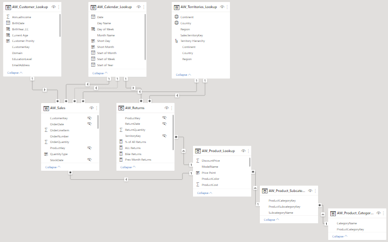

# Adventure Works Store Dashboard<!-- omit in toc -->

# Table Of Content<!-- omit in toc -->
- [Overview](#overview)
    - [In this project:](#in-this-project)
- [Dashboard](#dashboard)
- [Dataset](#dataset)
- [Data Model](#data-model)
- [Solution](#solution)
  - [Executive Summary Page](#executive-summary-page)
  - [Customer Details Page](#customer-details-page)

# Overview
### In this project: 

- **Imported** and **Cleaned** the data using  **Power Query Editor**.

- Created **Measures** using **DAX** to calculate helpful metrics such as monthly revenue, total orders and top performing products.

- Used a Star schema Data Modeling approach to connect the data with an exception to the Product table that extends to 2 more tables (Product Category and Product Sub-Category). 

- Created a 2 pages dashboard for Adventure Works Store:
  - An Executive Summary page showing monthly **revenue KPI's** and **top products in terms of orders and revenue**.
  - A Customer details page showing customers by **gender** and **income level**, Top customer driving the **most revenue** and their **order count**. 

# Dashboard

  

    
  

  

    
  

# [Dataset](\Dataset)
The Adventure Works public dataset is a robust collection of CSV files containing essential data for analyzing sales and customer behavior. It includes:

- Sales files spanning three years (2015-2017).
- `AdventureWorks_Calendar.csv`
- `AdventureWorks_Customers.csv`
- `AdventureWorks_Products.csv`
- `AdventureWorks_Product_Categories.csv`
- `AdventureWorks_Product_Subcategories.csv`
- `AdventureWorks_Territories.csv`
- `AdventureWorks_Returns.csv`

This dataset provides a rich source of information for building insightful and actionable dashboards using Power BI, allowing users to gain valuable insights into customer trends and sales performance.

****

# Data Model

The Adventure Works Power BI dashboard solution uses a data model consisting of **two fact tables** and **six lookup tables**. 

The **sales** and **returns** fact tables provide detailed information on sales and returns over time. 

The lookup tables, such as the calendar and product tables, provide additional context and are linked together using primary and foreign keys to create a relational structure. 

This structure allows for flexible data analysis and insightful visualizations, providing users with actionable insights into sales trends, customer behavior, and product performance to support informed business decisions.

****

# Solution
The Adventure Works dashboard solution is a two-page Power BI report.

## Executive Summary Page

Click To View The Page

The Adventure Works executive summary provides a comprehensive overview of monthly revenue, orders, and returns, as well as total orders by subcategory. 

This page includes dynamic visualizations, including a tree graph and a horizontal bar chart, which allow users to drill down into specific regions and time periods. 

Additionally, the dashboard features two cards displaying the top products by profit and orders, respectively. 

With its interactive filters, this dashboard solution enables Adventure Works stores to make informed business decisions based on the latest sales trends and metrics.

## Customer Details Page

Click To View The Page

The Adventure Works customer details page is a comprehensive Power BI report that provides insight into customer behavior. 

This page includes two doughnut charts showing orders by income level and gender, a line and bar chart displaying total orders and revenue by month, a table showing customer names, total orders, and revenue, and a card highlighting the top customer in terms of revenue. 

With its interactive filters, this dashboard solution enables Adventure Works stores to gain a deeper understanding of their customer base and make informed business decisions based on customer behavior and preferences.

## Authors <!-- omit in toc -->
+ [Hossam El Shabory](https://github.com/hossam-elshabory)
